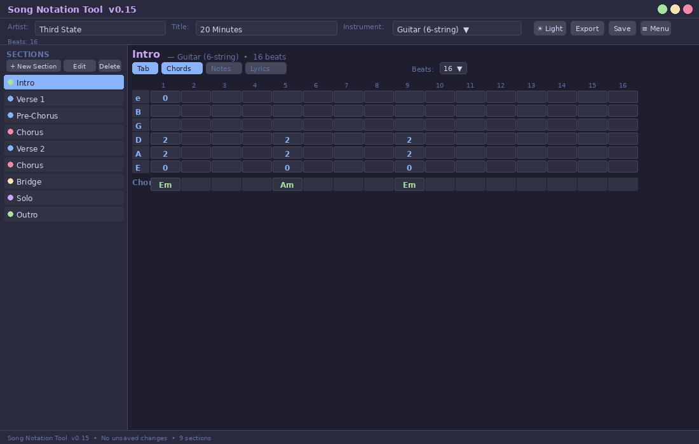
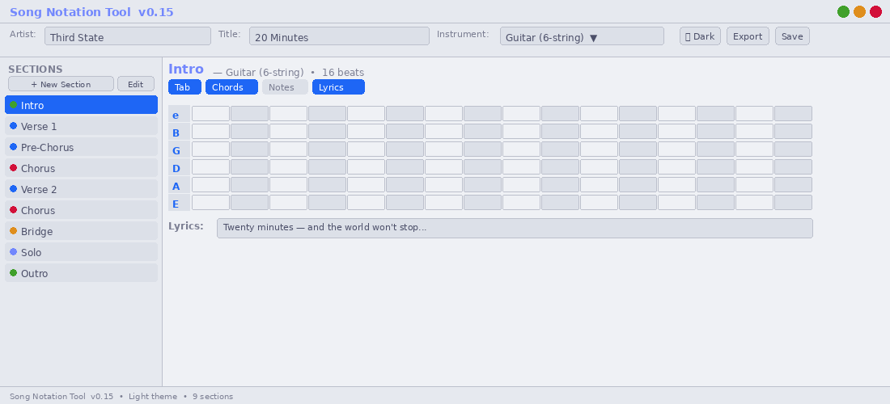

# 🎸 Song Notation Tool

> **⚠️ DRAFT / DEMO — Vibecoded Prototype**
> This is an early-stage personal project built through iterative AI-assisted ("vibecoded") development. It is functional but rough around the edges. Use it, break it, and feel free to suggest improvements!

---

A lightweight desktop app for sketching guitar and bass songs by section — tabs, chords, notes, and lyrics in one place. Built entirely with Python's standard library (Tkinter), so **no pip installs required**.

Compatible with **macOS**, **Windows**, and **Linux**.

---

## ✨ Features

- **Section-based layout** — Intro, Verse, Chorus, Bridge, Solo, and more, arranged in a scrollable left panel
- **Four notation layers per section** — Tab, Chords, Notes, Lyrics — each togglable independently
- **Guitar & Bass tunings** — 6-string, 7-string, 4/5-string bass, with Drop D variants
- **Variable beats per measure** — 8, 16, 32, or 64 beats; configurable per section
- **Chromatic transposition** — Shift the entire song or individual sections by any number of semitones
- **Section linking** — Link sections so edits propagate automatically (great for repeated choruses)
- **Copy & paste sections** — Duplicate any section with a single dialog
- **Light / Dark theme** — Switch on the fly
- **Export** — Save as `.txt` (plain text) or `.pdf` (formatted sheet with footer)
- **Project files** — Save/load sessions as `.sng` (plain JSON, human-readable)
- **Hamburger menu** — Compact topbar for narrow windows; all file actions always accessible
- **Zero dependencies** — Pure Python standard library, works out of the box

---

## 📸 Screenshots





---

## 🚀 Quick Start

```bash
# No install needed — just run:
python3 song_writer_v.0.15.py
```

Requires Python 3.8+ with Tkinter (included in most Python distributions).

> On some Linux distros Tkinter is a separate package:
> ```bash
> sudo apt install python3-tk
> ```

---

## 📁 File Formats

| Extension | Description |
|---|---|
| `.sng` | Project file — plain JSON, stores all sections and layers |
| `.txt` | Plain-text export, readable in any editor |
| `.pdf` | Formatted export with title, artist, date footer |

---

## 🗺️ Roadmap

See [ROADMAP.md](ROADMAP.md) for planned features and version history.

---

## 🤝 Contributing

This is a personal / demo project for now, but feedback and ideas are very welcome!
Check [CONTRIBUTING.md](CONTRIBUTING.md) for how to report bugs or suggest features.

---

## 📄 License

MIT License — see [LICENSE](LICENSE).

> **Note:** This project is an independent personal tool and is not affiliated with, endorsed by, or connected to any commercial product or organisation.
