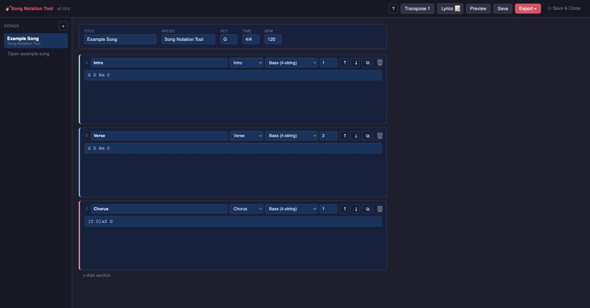

# 🎸 Song Notation Tool

> **⚠️ DRAFT / DEMO — Vibecoded Prototype**
> This is an early-stage personal project built through iterative AI-assisted ("vibecoded") development. It is functional but rough around the edges. Use it, break it, and feel free to suggest improvements!

---

## What this produces

A one-page stage chart, in the same compact vocabulary the author already
uses on paper: fret numbers over chord symbols, repeat counts, named riffs
referenced by name, and back-references so a repeated chorus isn't written
out twice.


Built entirely with Python's standard library — **no pip installs
required**, on the desktop app, the CLI, or the web server alike.
Compatible with **macOS**, **Windows**, and **Linux**, and runs three
ways:

- **Desktop app** (`song_writer.py`) — the Tkinter window described below.
- **Browser** (`webserver.py`) — a local web server + front end, reachable
  from a phone or tablet on the same network.
- **Headless CLI** (`cli.py`) — convert or batch-export `.sng` files from
  a script or CI job, no window at all.

All three run the exact same notation engine (`model.py` / `grammar.py`
/ `render.py` / `transpose.py` / `export.py`), so a chart looks the same
whichever way you made it.

---

## ✨ Features

- **Song map** — every section on screen at once as a rendered chart row
  (fret line over symbol line), not one section at a time
- **Chart grammar editor bar** — type a line like `5A 5D [5A 5D]x2 riff1
  x3` and it live-renders as you type; a parse error never clears the
  row, it just shows inline
- **Riff library** — name a recurring riff once, reference it by name
  from any section, and edit it once to update every section that uses
  it; deleting a riff still in use is blocked
- **Promote to riff** (Ctrl/Cmd+R) — select a run in the editor bar and
  turn it into a named riff in place
- **Duplicate as reference** (Ctrl/Cmd+D) — `=sectionname` rather than a
  copy, so a repeated section never duplicates its content
- **Drag or Alt+↑/↓ to reorder** sections — no dialog
- **Tab grid** for the occasional fully-notated bar — the rest of the
  song stays in the compact chart grammar
- **Guitar & Bass tunings** — 6-string, 7-string, 4/5-string bass, with
  Drop D variants
- **Non-destructive transposition** — shift the whole song or a section
  by any number of semitones, resolved at display/export time; +n then
  −n round-trips exactly because nothing is ever rewritten
- **Marks** — barlines, 1st/2nd endings, segno, coda, D.C./D.S., `simile`
- **Stage View** (Ctrl/Cmd+P) — full-window, high-contrast, read-only
- **Live page-count indicator**, and a PDF export that never splits a
  section across a page break
- **Compact export** — empty strings are dropped, references aren't
  expanded, and PDF targets one page (Portrait A4 default)
- **Light / Dark theme** — switch on the fly
- **Export** — save as `.txt` (plain text) or `.pdf` (formatted sheet with
  footer)
- **Project files** — save/load sessions as `.sng` (plain JSON,
  human-readable); `.sng` files from earlier versions load without loss
- **Zero dependencies** — pure Python standard library, works out of the box
- **"Start here" on first launch** — *New song*, *Open example*, or
  *Import project* instead of a blank grid
- **In-app help** — a "?" button explains the chart-line syntax,
  repeats, riffs, and transpose in plain language, any time
- **Live Preview window** — see the TXT/PDF export update as you edit
- **Runs headless or in a browser too** — see [CLI & Web Use](#-cli--web-use) below

---

## 📸 Screenshots



---

## 🚀 Quick Start

```bash
# Desktop app — no install needed, just run:
python3 song_writer.py
```

Requires Python 3.8+ with Tkinter (included in most Python distributions).

> On some Linux distros Tkinter is a separate package:
> ```bash
> sudo apt install python3-tk
> ```

The CLI and web server don't need Tkinter at all:

```bash
python3 cli.py --help
python3 webserver.py
```

See [CLI & Web Use](#-cli--web-use) below for the full command reference.

---

## 💻 CLI & Web Use

### Headless CLI

No window, no Tkinter import — for scripts and CI jobs.

```bash
# Convert one song to PDF (defaults to "<Artist> - <Title>.pdf")
python3 cli.py convert -i song.sng -e pdf

# ...or to TXT, only the bass parts
python3 cli.py convert -i song.sng -e txt --instrument "Bass (4-string)"

# Regenerate every .sng in a folder — e.g. before a gig, or after a
# formatting change
python3 cli.py batch -i songs/ -e pdf
python3 cli.py batch -i songs/ -e txt --out-dir exports/

# Sanity-check a .sng file's chart lines without opening the GUI
python3 cli.py lint -i song.sng
```

Run `python3 cli.py --help` (or `... convert --help` / `... batch --help`)
for the full option list.

### Browser

A thin local web server, standard library only:

```bash
python3 webserver.py                  # opens a window automatically
python3 webserver.py --dir mysongs --port 9000
python3 webserver.py --browser        # force a normal browser tab
python3 webserver.py --no-open        # just start the server
python3 webserver.py --host 0.0.0.0   # reachable from other devices on the LAN
```

Running it opens a window for you automatically — no need to copy a
URL into a browser by hand. If the optional
[`pywebview`](https://pypi.org/project/pywebview/) package is installed
(`pip install pywebview`, or `pip install -r requirements-optional.txt`),
that window is **frameless** — no OS titlebar, no browser chrome at
all — the same launch experience as the sibling
[qlc-plus-swiss-knife-tool-script](https://github.com/giopas/qlc-plus-swiss-knife-tool-script)
project's window, minus its titlebar too. Without `pywebview` it falls
straight back to your default browser tab instead, and prints the
install command so you know it's available; either way it's the same
page underneath — `pywebview` is entirely optional, never required to
run the server.

Because the window has no titlebar, the front end's **"⏻ Save &
Close"** button (top right) is the normal way to quit — it saves the
song you have open, then closes the window (or, in a plain browser
tab, stops the server). The window can still be dragged by clicking
anywhere in it, and Cmd/Ctrl+Q still works as a fallback.

Once it's open, you get the song list, meta form, and a chart-line
editor per section with the same live-parsing preview the desktop
app's editor bar has, plus TXT/PDF export. Tab-grid (measure) sections
are read-only in the browser for now — edit those in the desktop app;
chart-line sections are fully editable. See [ROADMAP.md](ROADMAP.md)
for what's still desktop-only.

---

## 📁 File Formats

| Extension | Description |
|---|---|
| `.sng` | Project file — plain JSON, stores all sections and layers |
| `.txt` | Plain-text export, readable in any editor |
| `.pdf` | Formatted export with title, artist, date footer |


---

## 🗺️ Roadmap

See [ROADMAP.md](ROADMAP.md) for planned features, and
[CHANGELOG.md](CHANGELOG.md) for what's already shipped.

---

## 🛠️ Development

See [DEVELOPMENT.md](DEVELOPMENT.md) for how sessions on this project are
run, `DESIGN_v0_16.md` for the data model, chart grammar, and
transposition rules, and `DESIGN_v0_17.md` for the song map / riff
library / chart editor bar this release is built on.

**Architecture**, since v0.18: `model.py` / `grammar.py` / `render.py` /
`transpose.py` / `songmap.py` / `export.py` / `examples.py` /
`constants.py` are pure Python with no Tkinter import — `song_writer.py`
(desktop), `cli.py` (headless), and `webserver.py` (browser) are three
front ends over that one engine. `tests/test_export.py` asserts
`export.py` specifically stays Tkinter-free.

Run the test suite with:

```bash
pip install pytest
python3 -m pytest tests/
```

---

## 🤝 Contributing

This is a personal / demo project for now, but feedback and ideas are very welcome!
Check [CONTRIBUTING.md](CONTRIBUTING.md) for how to report bugs or suggest features.

---

## 📄 License

MIT License — see [LICENSE](LICENSE).

> **Note:** This project is an independent personal tool and is not affiliated with, endorsed by, or connected to any commercial product or organisation.
