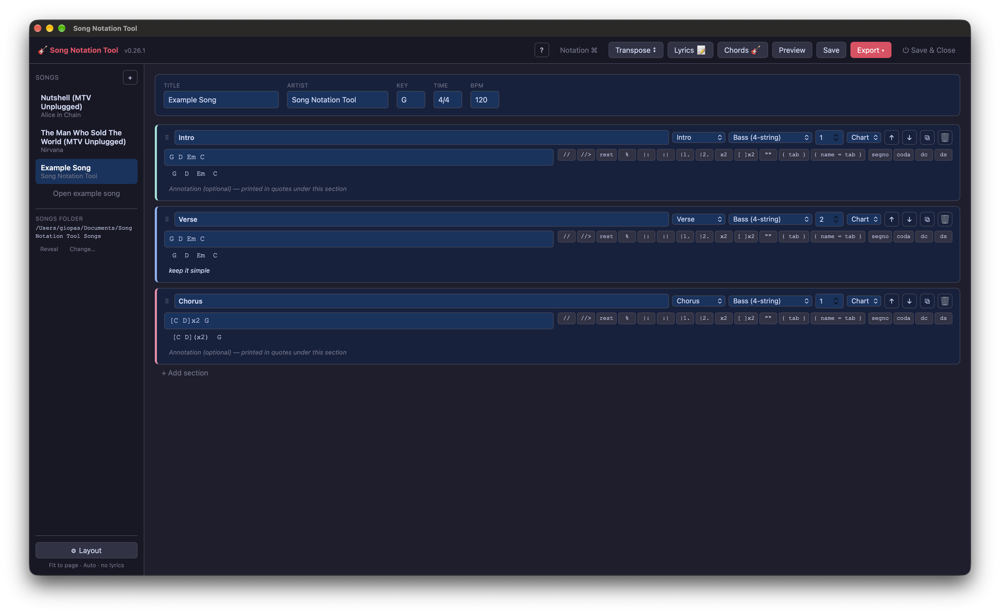
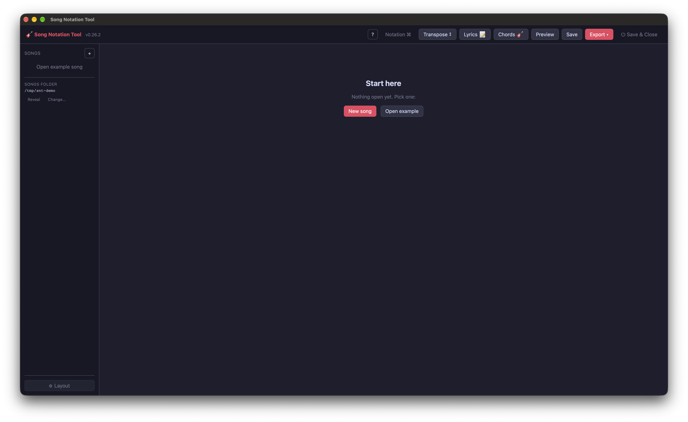
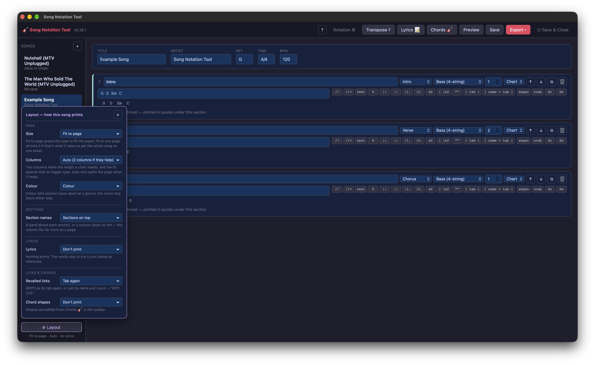
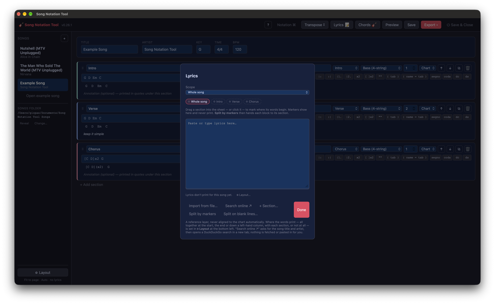
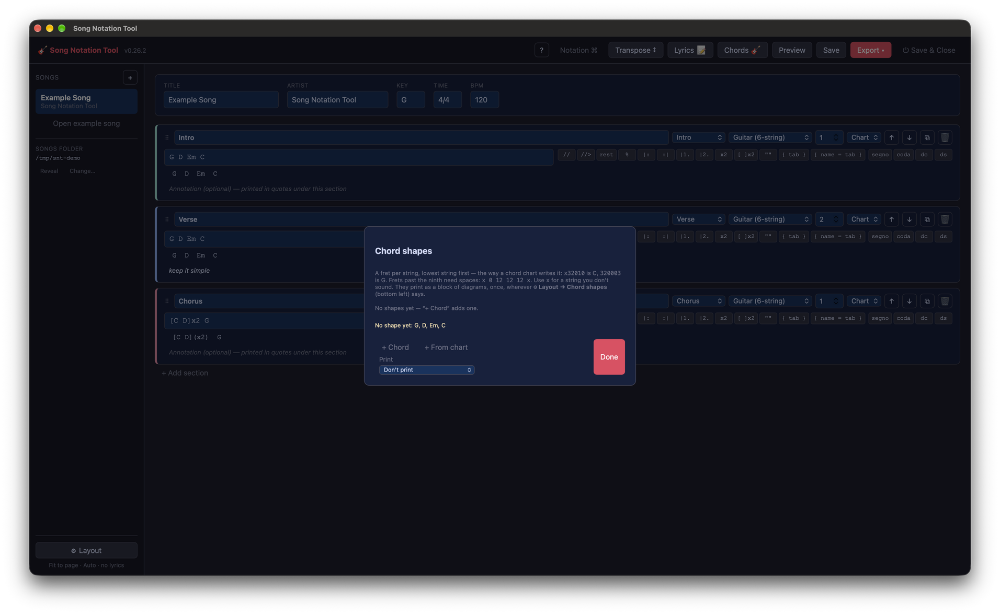
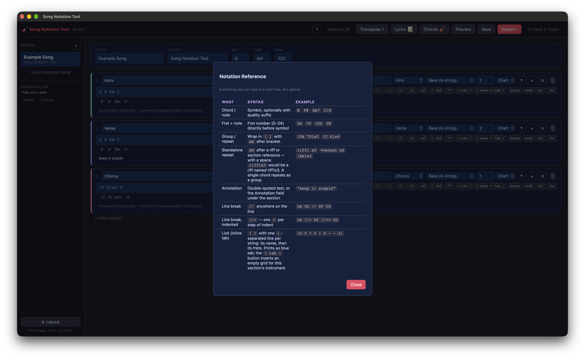
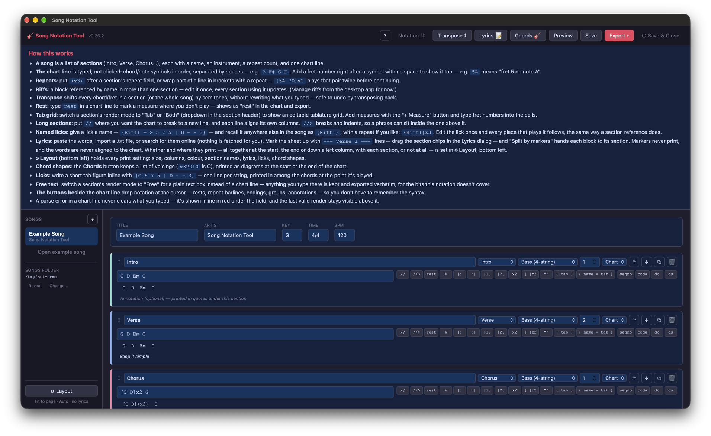
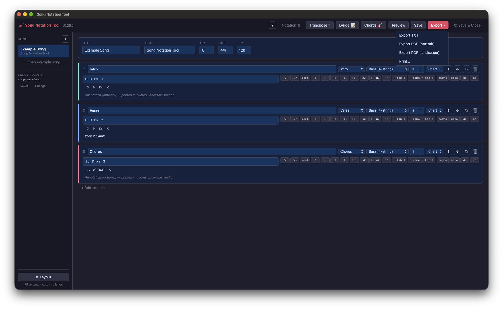

<p align="center"></p>

# Song Notation Tool

> This is an early personal project, built step by step with AI assistance
> ("vibecoded"). It works, but it has rough edges. Use it, break it, and
> suggestions are welcome.

## What it makes

A one-page stage chart, written the way the author already writes them on
paper: fret numbers over chord symbols, repeat counts, riffs named once and
called by name, and back-references so a repeated chorus is not written out
twice.

Everything runs on Python's standard library, so there is nothing to
install with pip. It works on macOS, Windows and Linux, in three ways:

- the desktop app (`song_writer.py`), a Tkinter window;
- the browser front end (`webserver.py`), a local web server you can also
  reach from a phone or tablet on the same network;
- the command line (`cli.py`), which converts or batch-exports `.sng` files
  from a script or a CI job without opening a window.

All three use the same notation engine (`model.py`, `grammar.py`,
`render.py`, `transpose.py`, `export.py`), so a chart looks the same
whichever way you made it.

## Features

Writing the chart

- The song map shows every section at once, each as a rendered chart row
  (fret line over symbol line).
- You type a chart line such as `5A 5D [5A 5D]x2 riff1 x3` and it renders
  as you type. A parse error is shown in the row and never clears it.
- A quick-insert palette beside every chart line puts barlines, 1st and
  2nd endings, segno, coda, D.C. and D.S., `simile` and the rest in at the
  cursor, so you do not have to remember the spelling. The Notation panel
  explains what each mark tells a player to do.
- `//` on a chart line breaks the section into the phrases you would write
  by hand, and each line lines up its own columns. `//>` breaks the line
  and indents it, so a phrase sits inside the one above.
- Licks: `{G 5 7 5 | D - - 3}` writes a short tab figure inline, where it
  is played, and prints it as a small tab block among the chords. It
  transposes with the section. In the PDF every fret sits on its column
  and each string is a solid line from bar to bar, so frets played
  together line up across strings.
- Named licks: `{Riff1 = G 5 7 5 | D - - 3}` names a figure and `{Riff1}x3`
  plays it again anywhere in the song. Braces are for licks; `=` is for
  sections. Edit the lick once and every place that plays it follows. The
  name prints in front of the tab (`Riff1 |G|-5-7-5-|`), and a recalled
  lick can print as tab again or just as `Riff1 (x3)`, as a handwritten
  chart would. Every named lick gets its own button in the section's
  insert strip.
- A tab grid is there for the occasional bar you want fully written out.
  The rest of the song stays in the chart line.
- Free-text sections are a fourth render mode for what this notation does
  not cover: a plain text box, printed exactly as typed. Switching to it
  keeps the chart line, so switching back restores it.
- Tunings: 6-string and 7-string guitar, 4-string and 5-string bass, with
  Drop D variants.

Riffs and repeated sections (desktop app)

- The riff library: name a recurring riff once, use it by name in any
  section, and edit it once to change every section that uses it. A riff
  still in use cannot be deleted.
- **Promote to riff** (Ctrl/Cmd+R) turns a selected run in the editor bar
  into a named riff in place.
- **Duplicate as reference** (Ctrl/Cmd+D) adds `=sectionname` instead of a
  copy, so a repeated section never duplicates its content.
- Drag a section, or press Alt+↑/↓, to reorder.
- A reference prints the notes it plays. On screen it shows the target's
  current name, and the file stores an id, so renaming the target does not
  break it.

Transposing

- Shift the whole song or one section by any number of semitones. The
  change is applied when the chart is shown or exported, and what you
  typed is never rewritten, so +n then −n gets you back exactly. It works
  in the desktop app and in the browser.

Lyrics and chord shapes

- The **Lyrics** panel takes words you paste, type or import from a
  `.txt` file, for one section or the whole song. **Search online ↗** opens
  a search in your browser. The words are kept as reference text, never
  parsed, and they stay out of the export and the Preview until you choose
  where they go. Mark the sheet with `=== Verse 1 ===` lines (drag a
  section's chip in, or click it) and **Split by markers** gives each block
  to the section it names. **Split on blank lines…** handles a sheet pasted
  straight from a lyrics site.
- **Chords 🎸** keeps a list of voicings (`x32010`) and prints them as tab
  diagrams at the start or the end of the chart. The list is checked
  against the chords the chart plays (**+ From chart** adds the missing
  ones), and the shapes are re-voiced when the song is transposed: an open
  shape goes to the open shape of the new chord, or else to its barre.

Printing and export

- **⚙ Layout** holds every print setting in one panel at the bottom left:
  page size, columns, colour, section names, lyrics, licks and chord
  shapes. The settings belong to the song. See
  [Printing and page layout](#printing-and-page-layout).
- Export to `.txt` (plain text) or `.pdf`, a formatted sheet with a footer
  that shows the version, the date and the project link. Exports open a
  real save panel and tell you where the file went.
- **Print…** goes through the system's own print panel, with a preview.
- The PDF fills the page, or shrinks the chart to fit on one page, in one
  or two columns (portrait A4 by default). Empty strings are left out, and
  a section is never split across a page break.
- The live Preview shows the TXT and PDF output as you edit.

Files

- Songs are saved as `.sng` files (plain JSON you can read). Files from
  earlier versions open without losing anything.
- Songs live in `~/Documents/Song Notation Tool`, outside this checkout,
  and the app shows you the folder. Each file is named after its song,
  `Artist - Title.sng`, and renamed on Save if you change the title.
  **Change…** picks a new folder and moves your songs there: only `.sng`
  files move, nothing is overwritten, and the old folder stays.

Getting around

- The first time, **Start here** offers *New song*, *Open example* or
  *Import project* instead of a blank grid.
- The **?** button explains the chart line, repeats, riffs and transpose
  in plain words.
- Stage View (Ctrl/Cmd+P in the desktop app): full window, high contrast,
  read only.
- The desktop app shows a live page count and switches between a light and
  a dark theme.

## Screenshots

The editor: songs on the left, one card per section. Type the chart line
and the rendered chart appears under it. The buttons beside each line
insert notation at the cursor.



<table>
<tr><td width="50%" valign="top"><a href="screenshots/start-here.png"></a><br><b>Start here</b>: a new or returning user sees New song and Open example instead of an empty grid.</td><td width="50%" valign="top"><a href="screenshots/layout-panel.png"></a><br><b>⚙ Layout</b>: every print setting in one panel at the bottom left (size, columns, colour, section names, lyrics, licks, chord shapes).</td></tr>
<tr><td width="50%" valign="top"><a href="screenshots/lyrics-dialog.png"></a><br><b>Lyrics</b>: paste or import the words, drag a section's chip into the sheet where its words begin, then <b>Split by markers</b>.</td><td width="50%" valign="top"><a href="screenshots/chord-shapes.png"></a><br><b>Chord shapes</b>: voicings typed as <code>x32010</code> and checked against the chords the chart plays. <b>+ From chart</b> adds the missing ones.</td></tr>
<tr><td width="50%" valign="top"><a href="screenshots/notation-reference.png"></a><br><b>Notation reference</b>: everything you can type on a chart line, with examples checked against the real parser.</td><td width="50%" valign="top"><a href="screenshots/help-strip.png"></a><br><b>How this works</b>: the ideas behind the chart line, one line each.</td></tr>
<tr><td width="50%" valign="top"><a href="screenshots/export-menu.png"></a><br><b>Export</b>: TXT, PDF in portrait or landscape, or the system print dialog.</td><td width="50%"></td></tr>
</table>

## Quick start

```bash
# Desktop app: nothing to install, just run it
python3 song_writer.py
```

You need Python 3.8 or later with Tkinter, which most Python installs
include. On some Linux distributions Tkinter is a separate package:

```bash
sudo apt install python3-tk
```

The command line and the web server do not need Tkinter:

```bash
python3 cli.py --help
python3 webserver.py
```

## CLI and web use

### Command line

No window and no Tkinter, for scripts and CI jobs.

```bash
# Convert one song to PDF (defaults to "<Artist> - <Title>.pdf")
python3 cli.py convert -i song.sng -e pdf

# ...or to TXT, only the bass parts
python3 cli.py convert -i song.sng -e txt --instrument "Bass (4-string)"

# Regenerate every .sng in a folder, e.g. before a gig or after a
# formatting change
python3 cli.py batch -i songs/ -e pdf
python3 cli.py batch -i songs/ -e txt --out-dir exports/

# Check a .sng file's chart lines without opening the GUI
python3 cli.py lint -i song.sng
```

`python3 cli.py --help` (or `... convert --help`, `... batch --help`) lists
every option.

### Browser

A small local web server, standard library only:

```bash
python3 webserver.py                  # opens a window automatically
python3 webserver.py --dir mysongs --port 9000
python3 webserver.py --browser        # use a normal browser tab
python3 webserver.py --no-open        # just start the server
python3 webserver.py --host 0.0.0.0   # reachable from other devices on the LAN
```

It opens a window by itself, so there is no URL to copy. If the optional
[`pywebview`](https://pypi.org/project/pywebview/) package is installed,
you get a native app window: resizable, with its own minimize, maximize
and close buttons, and no address bar or tabs. It works like the window of
the sibling
[qlc-plus-swiss-knife-tool-script](https://github.com/giopas/qlc-plus-swiss-knife-tool-script)
project. `webserver.py` also finds `pywebview` in a `.venv` next to it and
switches to that environment itself, so a plain `python3 webserver.py`
opens the native window with no virtualenv to activate and no environment
variables to set. Without `pywebview` it opens your default browser
instead and prints the install command. The page is the same either way,
and `pywebview` is never required.

To set up the native window once (macOS, Linux or Windows):

```bash
python3 -m venv .venv
.venv/bin/python3 -m pip install -r requirements-optional.txt
```

On macOS that is all: `pywebview` brings the PyObjC and WebKit bindings it
needs, and there is no Homebrew package or system framework to add. From
then on `python3 webserver.py` opens the native window, because it looks
for a virtualenv next to it that can `import webview` and restarts itself
inside it. `SNT_NO_REEXEC=1` turns that off, and `--browser` and
`--no-open` skip it.

The **⏻ Save & Close** button (top right) saves the open song and closes
the window, or stops the server when you are in a plain browser tab. The
window's own close button still works.

In the browser you get the song list, the song details, and a chart-line
editor for each section with the same live preview as the desktop app.
There is TXT and PDF export, **Transpose** (whole song or one section), the
**Lyrics** panel (with section markers you can drag into the sheet), the
**Chords** dialog, and a quick-insert palette beside each chart line. The
palette inserts rests, repeat barlines, endings, groups, annotations, licks
and every lick you have already named, at the cursor. Free-text sections
work too, and **⚙ Layout** at the bottom left of the sidebar holds
everything about how the song prints.

Tab-grid sections can be edited in the browser as well: switch a section
to Tab or Both, add measures, and type fret numbers into the cells. The
render mode decides what prints. Chart prints the chart line, Tab prints
the grid, and Both prints both, so a grid left behind when you switch a
section back to Chart stays out of the export, as it stays out of the
card. Managing riffs and blocks is still desktop only; see
[ROADMAP.md](ROADMAP.md).

The toolbar, the song list and the songs folder stay in place and only the
section list scrolls, so **Save**, **Preview** and **Export** are always in
reach in a long song.

### Printing and page layout

**Print…** (in the **Export** menu) builds the PDF and opens it in your
system's PDF viewer, so you get the real print panel (printer, paper size,
scaling, page range) and a preview before anything is printed. In a
browser tab the PDF opens in a new tab, where Cmd/Ctrl+P does the same.

The settings that shape the exported chart are in **⚙ Layout**, at the
bottom left of the sidebar. In the desktop app it is a **⚙ Layout** button
along the bottom of the window. It covers Size, Columns and Colour for the
page, where section names go, where the lyrics go, how recalled licks
print, and whether chord shapes print. A line under the button sums up
what is set. The settings are saved in the `.sng` and apply to the PDF,
Print and the Preview. TXT is plain text, so colour, size and columns do
not apply to it.

**Colour** gives each section heading a colour by section type, so you can
find your place on a music stand at a glance, and every Verse looks like
every other Verse. The notes stay black; the colour labels the sections.
**Black & white** fills the heading bands with light grey and sets the text
in black. That suits a mono printer or a photocopy, where colours turn
into greys that look alike, and it saves toner.

When every section uses the same instrument, the instrument is printed
once in the header, next to the key and tempo.

**Size** is how much of the paper the chart uses. **Fit to page** enlarges
the chart until it fills the sheet without needing another page, so you
can read it on a stand or on the floor. It also shrinks a chart whose
longest line would run off the edge. **Fit to one page** shrinks the type
as far as needed to get the whole song on one sheet, which helps when the
alternative is turning a page mid-song. If even the smallest readable size
is not enough, the chart stays at that size and runs to two pages. The
fixed percentages are there when you want a set size.

**Columns** splits the page. Most chart lines are short (four chord
symbols, a bar of tab), so a single column leaves half the page white, and
Fit to page can only grow the type until that column is full. Two columns
halve the height the chart needs, and the fit spends the space on bigger
type: the same song, larger, and often on one sheet instead of two. A grey
rule runs down the gutter, and you read down the left column, then the
right. **Auto** (the default) builds both and keeps the better one (fewer
sheets first, then bigger type), and keeps one column when the lines are
too long for half a page.

**Layout** chooses where each section's name goes:

- **Sections on top**: a full-width header band above each section.
- **Sections on the left**: the name sits in a left-hand column beside the
  section's first line. This saves three lines per section, which for most
  songs is the difference between a one-page and a two-page chart.

This setting is saved in the `.sng` too, so a chart prints the same
wherever it is opened, and it applies to TXT, PDF, Print and the Preview.

### Where the words go

One setting for the whole song, in **⚙ Layout**:

| Choice | What prints |
|---|---|
| Don't print | Nothing (the default). The words stay in the Lyrics dialog. |
| All together — at the start | Every section's words in one block before the chart, each under its section's name |
| All together — at the end | The same, after the chart |
| All together — left column | The same block in a column on the left, with the chart in one column beside it |
| Each section — beside chart | Each section's words to the right of its own chart, next to what you play under them |
| Each section — under chart | Each section's words under its own chart |

None of them lines up chords with syllables. A chart like this cannot say
exactly where the changes fall, so it does not try. If no section has
words yet, the "all together" choices use the whole-song sheet, with its
`=== Verse 1 ===` markers as headings.

Beside the chart, every section's words start in the same column, so they
read straight down the page.

### Chord shapes

The **Chords 🎸** dialog keeps the voicings you had to work out, written as
a chord chart writes them: `x32010` is C, `320003` is G, and frets above 9
need spaces (`x 0 12 12 12 x`). They print once, as a block of tab-style
diagrams, at the start or the end of the chart:

```
  C         G
  e|-0-|    e|-3-|
  B|-1-|    B|-0-|
  G|-0-|    G|-0-|
  D|-2-|    D|-0-|
  A|-3-|    A|-2-|
  E|-x-|    E|-3-|
```

Each shape can carry a word of its own ("barre", "thumb"), and shapes for
different instruments are grouped instead of mixed in one row.

The dialog checks the shapes against the chart. It lists the chords the
song plays that have no shape yet, and the shapes for chords it never
plays, and **+ From chart** adds a row for each missing one. It reads the
chart as printed, so after a transpose it asks for the chords you will see
on the page.

When you transpose, the shapes move the way a player would re-voice them.
An open shape goes to the open shape of the new chord (C up a tone prints
as the open D, `xx0232`), or to its E-form or A-form barre when there is no
open shape. A barre slides up or down the neck. What you typed is what is
stored; only the printed sheet changes.

### Lyrics

**Lyrics** keeps the words as a reference layer. They are never parsed and
never lined up with the chart automatically, and they print only if you
ask: whether and where is set once for the song in **⚙ Layout** (see
[Where the words go](#where-the-words-go)), and the dialog shows which.
Paste them in, import a `.txt`, or use **Search online ↗**, which opens a
search in your browser and does not paste anything back.

The dialog lists the song's sections as chips under the **Scope** menu.
Each chip has a dot that fills once the section has words, so you can see
what is still empty and click straight to it.

**Split by markers** is the quick way. Write `=== Verse 1 ===` above the
words that belong to that section (or drag the section's chip into the
sheet, which writes the marker for you), and each marked block goes to the
section it names. Names match loosely, so `=== Chorus_1 ===` finds
"Chorus 1". A section the sheet does not mention is left as it was, and a
name with no section behind it is offered as a new section.
**+ Section…** in the dialog does the same from scratch and marks the sheet
as it goes. The markers show in the editor, in colour, and never print.

**Split on blank lines…** is for a sheet pasted straight from a lyrics site
with no markers. It cuts the whole song's sheet at its blank lines and
gives you one row per section, with a menu of the blocks. A block can go to
as many sections as sing it, which is how a chorus written once reaches
Chorus 1, 2 and 3. The first suggestion reads the sheet as a player would:
a block written out twice is the chorus, and instrumental sections are
skipped. The sheet itself is kept, so a section you add later can still get
one of its blocks.

### Where your files are kept

Every song is its own file, named after the song: `Artist - Title.sng`, or
just the title if there is no artist, so the folder reads like your song
list. If you change a song's title or artist, the file is renamed the next
time you save, and a message tells you. Another song is never overwritten
(a name that is taken becomes `… (2).sng`). Each save goes to a temporary
file first and then replaces the old one, so a crash during a save cannot
leave half a song behind.

**Open example song** always opens the example as shipped. Once you have
turned it into a song of your own, the next click makes a fresh example
instead of opening yours.

Songs live in `~/Documents/Song Notation Tool`, under your home folder and
outside this checkout. Whatever backs up your Documents covers them, and a
`git clean` or a fresh clone cannot remove them. Any `.sng` files left in
the old `songs/` folder inside the repository are moved there the first
time you run `webserver.py`, and it tells you what it moved. Nothing is
overwritten: a name that already exists in the target folder is left alone
and reported.

The sidebar shows the folder, with **Reveal** (open it in Finder) and
**Change…** next to it when you run the native window.

**Change…** opens a folder picker, then tells you what it would do before
doing it: how many songs will move, and which will stay because a song
with the same name is already in the new folder. You can move them, just
use the new folder and leave them where they are, or cancel. Only `.sng`
files move, nothing in the new folder is overwritten, and the old folder
is not deleted, so you can safely try iCloud Drive, Dropbox or an external
disk. The choice is saved in:

```
~/Library/Application Support/Song Notation Tool/config.json
```

`--dir` overrides it for one run without changing the setting.

Exports (TXT and PDF) open the system's save panel in the native window,
filled in with `<Artist> - <Title>.pdf` and starting in the folder you last
exported to. The app then shows the full path it wrote. A plain browser tab
has no save panel, so an export is an ordinary download and your browser
decides where it goes.

## File formats

| Extension | Description |
|---|---|
| `.sng` | Project file: plain JSON with all sections and layers |
| `.txt` | Plain-text export, readable in any editor |
| `.pdf` | Formatted export with title, artist and a date footer |

## Roadmap

[ROADMAP.md](ROADMAP.md) lists planned features, and
[CHANGELOG.md](CHANGELOG.md) what each version changed.

## Documentation

The [wiki](https://github.com/giopas/song-notation-tool/wiki) has the
longer pages: chart-line syntax, printing and page layout, CLI and web
use, and the architecture. It is published from `wiki/` in this
repository whenever `main` changes.

## Development

[DEVELOPMENT.md](DEVELOPMENT.md) describes how work on this project is
done (branches, commits, tests, releases), and [WORKPLAN.md](WORKPLAN.md)
has the current plan and the decisions in force. `DESIGN_v0_16.md` covers
the data model, the chart grammar and the transposition rules, and
`DESIGN_v0_17.md` the song map, the riff library and the chart editor bar.

`model.py`, `grammar.py`, `render.py`, `transpose.py`, `songmap.py`,
`export.py`, `examples.py` and `constants.py` are pure Python with no
Tkinter import. `song_writer.py` (desktop), `cli.py` (command line) and
`webserver.py` (browser) are three front ends on top of them.
`tests/test_export.py` checks that `export.py` stays free of Tkinter.

To run the tests:

```bash
pip install pytest
python3 -m pytest tests/
```

## Contributing

This is a personal project for now, but feedback and ideas are welcome.
[CONTRIBUTING.md](CONTRIBUTING.md) explains how to report a bug or suggest
a feature.

## License

MIT, see [LICENSE](LICENSE).

This is an independent personal tool. It is not affiliated with or
endorsed by any commercial product or organisation.
